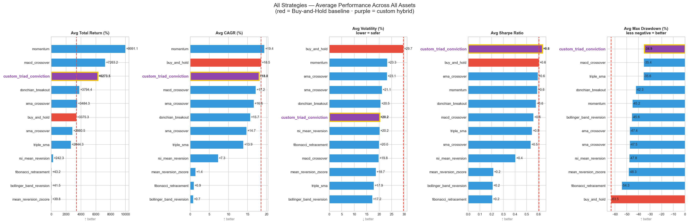
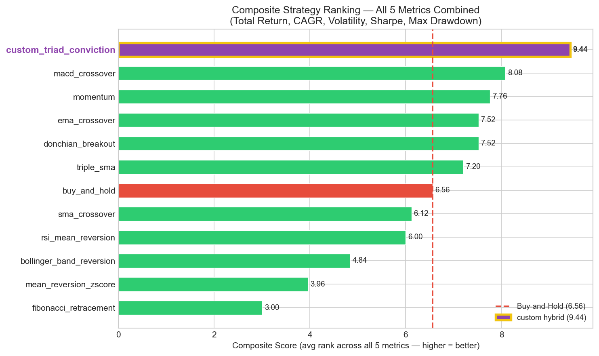
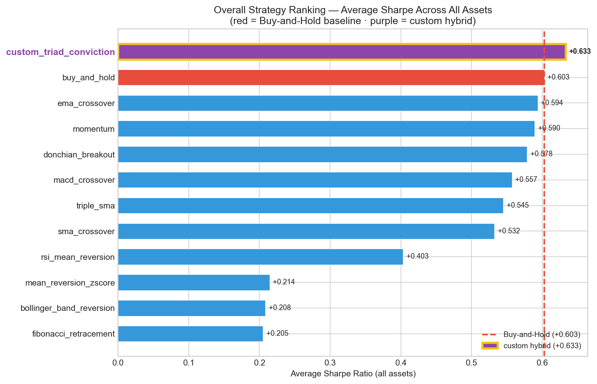
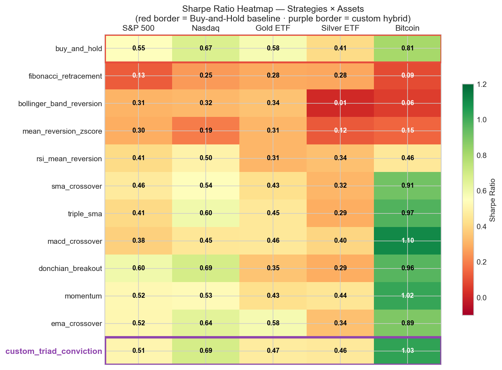
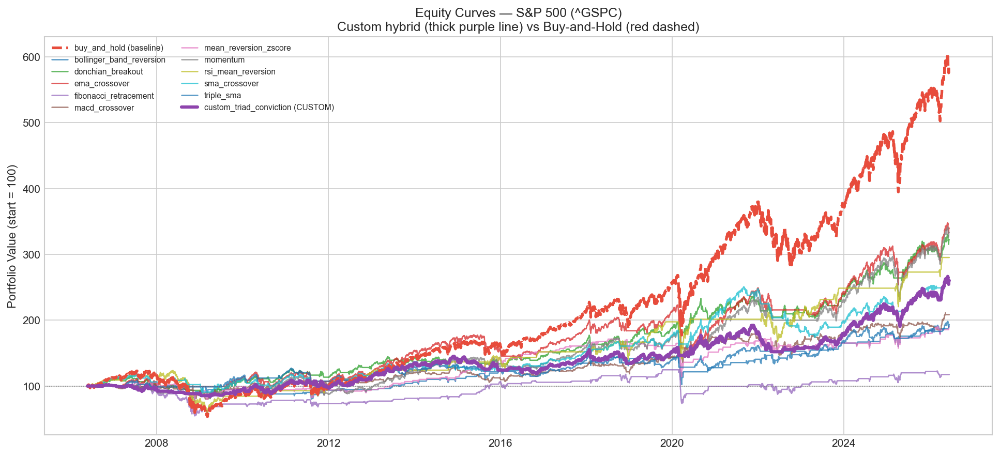
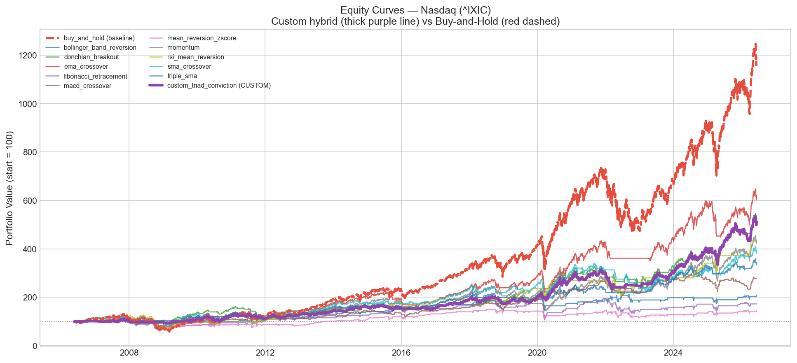
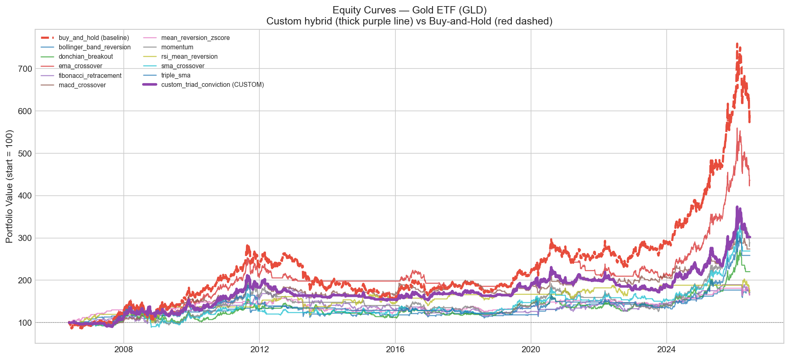
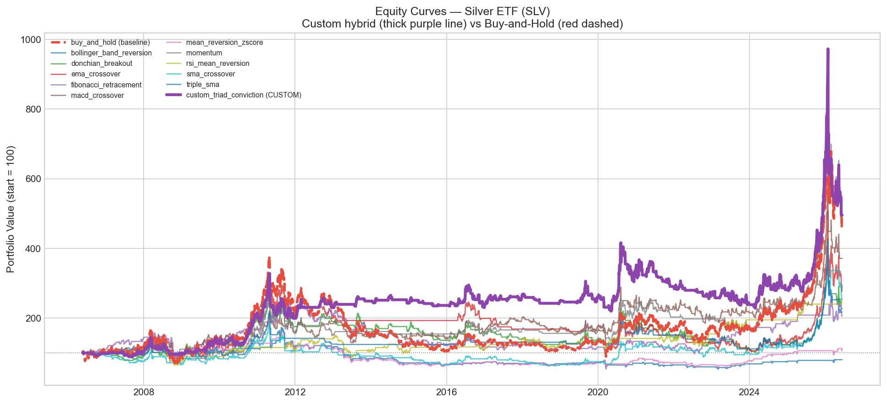
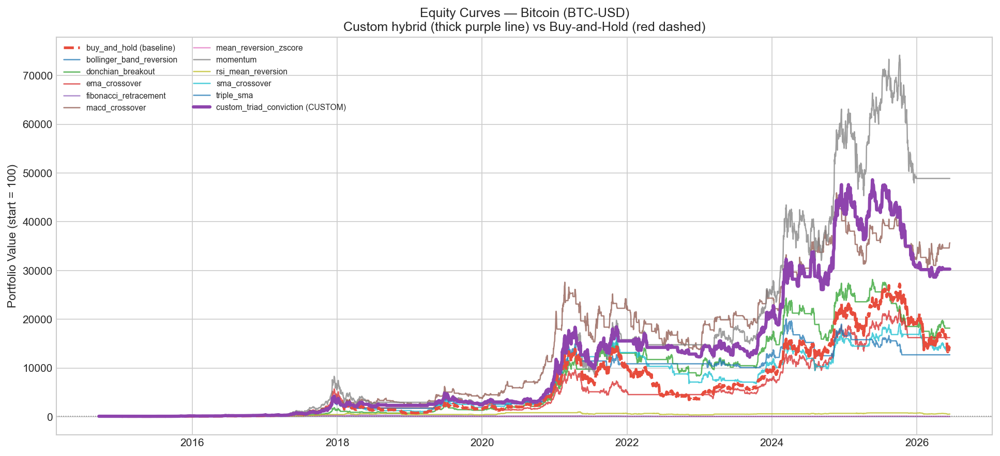

# 20-Year Multi-Strategy Backtest Report

**Generated:** 2026-06-16  
**Period:** 2006-05-20 → 2026-06-16 (target: 20 years)  
**Universe:** ^GSPC, ^IXIC, GLD, SLV, BTC-USD  
**Initial capital:** $100,000 per strategy/asset pair  
**Commission:** 5 bps per trade side (next-bar execution)  
**Metrics tracked:** Total Return, CAGR, Volatility, Sharpe Ratio, Max Drawdown  
**Baseline:** every active strategy is compared against **buy-and-hold** on the same asset.  

## Data Coverage

| Asset | Symbol | Start | End | Trading Days | Years |
|-------|--------|-------|-----|--------------|-------|
| Bitcoin | `BTC-USD` | 2014-09-17 | 2026-06-16 | 4,291 | 17.0 |
| Gold ETF | `GLD` | 2006-05-22 | 2026-06-15 | 5,048 | 20.0 |
| Silver ETF | `SLV` | 2006-05-22 | 2026-06-15 | 5,048 | 20.0 |
| S&P 500 | `^GSPC` | 2006-05-22 | 2026-06-15 | 5,048 | 20.0 |
| Nasdaq | `^IXIC` | 2006-05-22 | 2026-06-15 | 5,048 | 20.0 |

> **Note:** BTC-USD available from September 2014 (~12 years), not the full 20.

## Strategy Catalogue

| # | Strategy | Description |
|---|----------|-------------|
| 1 | `bollinger_band_reversion` | Long below lower Bollinger Band (20d, 2σ). |
| 2 | `buy_and_hold` *(baseline)* | Long from day 1, never exits (baseline). |
| 3 | `custom_triad_conviction` | Experimental hybrid of the top 3: MACD + momentum + Donchian vote; goes fully long when a majority (>=2 of 3) agree & throttled in bear regimes. |
| 4 | `donchian_breakout` | Long above 20-day high; exit on 20-day low. |
| 5 | `ema_crossover` | Golden Cross: long when EMA-50 > EMA-200. |
| 6 | `fibonacci_retracement` | Long at 61.8 % Fib level; exit at 38.2 %. |
| 7 | `macd_crossover` | Long when MACD line > signal line (12/26/9). |
| 8 | `mean_reversion_zscore` | Long when z-score < -1.5; exit when z > 0. |
| 9 | `momentum` | Long when 252-day trailing return is positive. |
| 10 | `rsi_mean_reversion` | Long when RSI-14 < 30; exit when RSI > 70. |
| 11 | `sma_crossover` | Long when fast SMA (20d) > slow SMA (50d). |
| 12 | `triple_sma` | Long only when SMA-10 > SMA-50 > SMA-200. |

## Multi-Metric Performance Overview

Each panel shows all strategies ranked on one metric. **Red bar & dashed line = buy-and-hold baseline.**

## Composite Ranking (All 5 Metrics Combined)

The composite score averages a strategy's **rank** across all five metrics (Total Return, CAGR, Volatility, Sharpe, Max Drawdown) and all five assets. A higher score means consistently good performance across every dimension — it cannot be won by excelling on one metric alone.

## Overall Ranking (Average Sharpe Across All Assets)

A simpler single-metric view: strategies ranked purely by their average Sharpe ratio across all five assets. **Red = buy-and-hold baseline · purple = the custom hybrid.**

| Rank | Strategy | Composite Score | vs B&H | Avg Return% | Avg CAGR% | Avg Vol% | Avg Sharpe | Avg DD% |
|------|----------|----------------|--------|------------|---------|--------|-----------|--------|
| 🥇 | `custom_triad_conviction` | 9.44 | ▲2.88 | +6273.5 | +18.00 | 20.2 | +0.633 | -34.9 |
| 🥈 | `macd_crossover` | 8.08 | ▲1.52 | +7263.2 | +17.16 | 19.8 | +0.557 | -35.4 |
| 🥉 | `momentum` | 7.76 | ▲1.20 | +9991.1 | +19.41 | 23.3 | +0.590 | -45.2 |
|  4. | `ema_crossover` | 7.52 | ▲0.96 | +3484.3 | +16.63 | 23.1 | +0.594 | -47.4 |
|  5. | `donchian_breakout` | 7.52 | ▲0.96 | +3794.4 | +15.70 | 20.5 | +0.578 | -42.3 |
|  6. | `triple_sma` | 7.20 | ▲0.64 | +2644.3 | +13.91 | 17.9 | +0.545 | -35.6 |
|  7. | `buy_and_hold` | 6.56 | *(baseline)* | +3375.3 | +18.53 | 29.7 | +0.603 | -63.5 |
|  8. | `sma_crossover` | 6.12 | ▼0.44 | +2860.5 | +14.74 | 21.1 | +0.532 | -47.5 |
|  9. | `rsi_mean_reversion` | 6.00 | ▼0.56 | +242.3 | +7.29 | 20.2 | +0.403 | -47.8 |
|  10. | `bollinger_band_reversion` | 4.84 | ▼1.72 | +41.5 | +0.75 | 17.2 | +0.208 | -45.6 |
|  11. | `mean_reversion_zscore` | 3.96 | ▼2.60 | +39.8 | +1.36 | 18.7 | +0.214 | -48.3 |
|  12. | `fibonacci_retracement` | 3.00 | ▼3.56 | +43.2 | +0.91 | 20.0 | +0.205 | -54.3 |

## Per-Metric Leaderboards

Each table ranks strategies on **one metric only**, averaged across all assets. B&H reference shown for every entry.

### Total Return (%)

*↑ higher is better. B&H value: +3375.3.*

| Rank | Strategy | Avg Total Return (%) | vs B&H |
|------|----------|------------|--------|
| 🥇 | `momentum` | +9991.1 | ▲6615.81 |
| 🥈 | `macd_crossover` | +7263.2 | ▲3887.83 |
| 🥉 | `custom_triad_conviction` | +6273.5 | ▲2898.18 |
|  4. | `donchian_breakout` | +3794.4 | ▲419.03 |
|  5. | `ema_crossover` | +3484.3 | ▲108.96 |
|  6. | `buy_and_hold` | +3375.3 | *(baseline)* |
|  7. | `sma_crossover` | +2860.5 | ▼514.78 |
|  8. | `triple_sma` | +2644.3 | ▼731.02 |
|  9. | `rsi_mean_reversion` | +242.3 | ▼3133.03 |
|  10. | `fibonacci_retracement` | +43.2 | ▼3332.12 |
|  11. | `bollinger_band_reversion` | +41.5 | ▼3333.83 |
|  12. | `mean_reversion_zscore` | +39.8 | ▼3335.52 |

### CAGR (%)

*↑ higher is better. B&H value: +18.53.*

| Rank | Strategy | Avg CAGR (%) | vs B&H |
|------|----------|------------|--------|
| 🥇 | `momentum` | +19.41 | ▲0.88 |
| 🥈 | `buy_and_hold` | +18.53 | *(baseline)* |
| 🥉 | `custom_triad_conviction` | +18.00 | ▼0.53 |
|  4. | `macd_crossover` | +17.16 | ▼1.37 |
|  5. | `ema_crossover` | +16.63 | ▼1.90 |
|  6. | `donchian_breakout` | +15.70 | ▼2.83 |
|  7. | `sma_crossover` | +14.74 | ▼3.79 |
|  8. | `triple_sma` | +13.91 | ▼4.62 |
|  9. | `rsi_mean_reversion` | +7.29 | ▼11.25 |
|  10. | `mean_reversion_zscore` | +1.36 | ▼17.17 |
|  11. | `fibonacci_retracement` | +0.91 | ▼17.62 |
|  12. | `bollinger_band_reversion` | +0.75 | ▼17.78 |

### Volatility (%, lower=better)

*↓ lower is better. B&H value: 29.7.*

| Rank | Strategy | Avg Volatility (%, lower=better) | vs B&H |
|------|----------|------------|--------|
| 🥇 | `bollinger_band_reversion` | 17.2 | ▲12.46 |
| 🥈 | `triple_sma` | 17.9 | ▲11.81 |
| 🥉 | `mean_reversion_zscore` | 18.7 | ▲11.03 |
|  4. | `macd_crossover` | 19.8 | ▲9.89 |
|  5. | `fibonacci_retracement` | 20.0 | ▲9.73 |
|  6. | `rsi_mean_reversion` | 20.2 | ▲9.52 |
|  7. | `custom_triad_conviction` | 20.2 | ▲9.49 |
|  8. | `donchian_breakout` | 20.5 | ▲9.14 |
|  9. | `sma_crossover` | 21.1 | ▲8.61 |
|  10. | `ema_crossover` | 23.1 | ▲6.57 |
|  11. | `momentum` | 23.3 | ▲6.43 |
|  12. | `buy_and_hold` | 29.7 | *(baseline)* |

### Sharpe Ratio

*↑ higher is better. B&H value: +0.603.*

| Rank | Strategy | Avg Sharpe Ratio | vs B&H |
|------|----------|------------|--------|
| 🥇 | `custom_triad_conviction` | +0.633 | ▲0.03 |
| 🥈 | `buy_and_hold` | +0.603 | *(baseline)* |
| 🥉 | `ema_crossover` | +0.594 | ▼0.01 |
|  4. | `momentum` | +0.590 | ▼0.01 |
|  5. | `donchian_breakout` | +0.578 | ▼0.02 |
|  6. | `macd_crossover` | +0.557 | ▼0.05 |
|  7. | `triple_sma` | +0.545 | ▼0.06 |
|  8. | `sma_crossover` | +0.532 | ▼0.07 |
|  9. | `rsi_mean_reversion` | +0.403 | ▼0.20 |
|  10. | `mean_reversion_zscore` | +0.214 | ▼0.39 |
|  11. | `bollinger_band_reversion` | +0.208 | ▼0.39 |
|  12. | `fibonacci_retracement` | +0.205 | ▼0.40 |

### Max Drawdown (%, less negative=better)

*↑ higher is better. B&H value: -63.5.*

| Rank | Strategy | Avg Max Drawdown (%, less negative=better) | vs B&H |
|------|----------|------------|--------|
| 🥇 | `custom_triad_conviction` | -34.9 | ▲28.64 |
| 🥈 | `macd_crossover` | -35.4 | ▲28.12 |
| 🥉 | `triple_sma` | -35.6 | ▲27.92 |
|  4. | `donchian_breakout` | -42.3 | ▲21.22 |
|  5. | `momentum` | -45.2 | ▲18.34 |
|  6. | `bollinger_band_reversion` | -45.6 | ▲17.93 |
|  7. | `ema_crossover` | -47.4 | ▲16.15 |
|  8. | `sma_crossover` | -47.5 | ▲15.99 |
|  9. | `rsi_mean_reversion` | -47.8 | ▲15.71 |
|  10. | `mean_reversion_zscore` | -48.3 | ▲15.25 |
|  11. | `fibonacci_retracement` | -54.3 | ▲9.21 |
|  12. | `buy_and_hold` | -63.5 | *(baseline)* |

## Sharpe Ratio Heatmap

Green = high Sharpe (good), red = low. B&H row outlined in red.

## Active Strategies vs Buy-and-Hold — Per Asset

All five metrics are shown with their delta vs B&H on the same asset. `Δ` values: positive always means **the strategy is better than B&H** on that metric.

### S&P 500 (`^GSPC`)

**Buy-and-Hold baseline:**
- Total Return: **+488.5%**  
- CAGR: **+9.24%**  
- Volatility: **19.5%** (annualised)  
- Sharpe: **+0.55**  
- Max Drawdown: **-56.8%**  

*Sorted by composite score. Δ = strategy minus B&H (positive = better than B&H).*

| Rank | Strategy | Ret% | Δ Ret | CAGR% | Δ CAGR | Vol% | Δ Vol | Sharpe | Δ Sharpe | MaxDD% | Δ MaxDD | Score |
|------|----------|------|-------|-------|--------|------|-------|--------|----------|--------|---------|-------|
| 🥇 | `donchian_breakout` | +222.2 | ▼266.32pp | +6.00 | ▼3.23pp | 10.7 | ▲8.82pp | +0.60 | ▲0.05 | -29.8 | ▲27.01pp | 9.40 |
| 🥈 | `momentum` | +233.5 | ▼255.04pp | +6.19 | ▼3.05pp | 13.1 | ▲6.38pp | +0.52 | ▼0.03 | -25.5 | ▲31.32pp | 9.20 |
| 🥉 | `custom_triad_conviction` | +160.2 | ▼328.36pp | +4.88 | ▼4.35pp | 10.4 | ▲9.13pp | +0.51 | ▼0.04 | -21.3 | ▲35.46pp | 8.40 |
|  4. | `ema_crossover` | +239.8 | ▼248.76pp | +6.29 | ▼2.95pp | 13.6 | ▲5.87pp | +0.52 | ▼0.04 | -30.0 | ▲26.78pp | 8.40 |
|  5. | `triple_sma` | +93.6 | ▼394.97pp | +3.35 | ▼5.89pp | 9.1 | ▲10.38pp | +0.41 | ▼0.14 | -17.2 | ▲39.60pp | 7.40 |
|  6. | `sma_crossover` | +160.2 | ▼328.31pp | +4.88 | ▼4.35pp | 11.8 | ▲7.73pp | +0.46 | ▼0.09 | -30.4 | ▲26.35pp | 6.80 |
|  7. | `macd_crossover` | +108.3 | ▼380.26pp | +3.72 | ▼5.51pp | 11.4 | ▲8.17pp | +0.38 | ▼0.17 | -24.7 | ▲32.05pp | 6.60 |
|  8. | `rsi_mean_reversion` | +195.2 | ▼293.36pp | +5.54 | ▼3.69pp | 16.5 | ▲3.02pp | +0.41 | ▼0.14 | -52.6 | ▲4.20pp | 5.20 |
|  9. | `bollinger_band_reversion` | +91.2 | ▼397.35pp | +3.28 | ▼5.95pp | 13.6 | ▲5.97pp | +0.31 | ▼0.24 | -29.5 | ▲27.25pp | 4.60 |
|  10. | `mean_reversion_zscore` | +89.7 | ▼398.87pp | +3.24 | ▼5.99pp | 14.3 | ▲5.24pp | +0.30 | ▼0.26 | -33.3 | ▲23.49pp | 2.60 |
|  11. | `fibonacci_retracement` | +17.4 | ▼471.18pp | +0.80 | ▼8.43pp | 14.0 | ▲5.56pp | +0.13 | ▼0.42 | -45.7 | ▲11.07pp | 2.00 |

### Nasdaq (`^IXIC`)

**Buy-and-Hold baseline:**
- Total Return: **+1090.9%**  
- CAGR: **+13.14%**  
- Volatility: **22.2%** (annualised)  
- Sharpe: **+0.67**  
- Max Drawdown: **-55.6%**  

*Sorted by composite score. Δ = strategy minus B&H (positive = better than B&H).*

| Rank | Strategy | Ret% | Δ Ret | CAGR% | Δ CAGR | Vol% | Δ Vol | Sharpe | Δ Sharpe | MaxDD% | Δ MaxDD | Score |
|------|----------|------|-------|-------|--------|------|-------|--------|----------|--------|---------|-------|
| 🥇 | `custom_triad_conviction` | +412.4 | ▼678.47pp | +8.48 | ▼4.66pp | 13.0 | ▲9.10pp | +0.69 | ▲0.02 | -24.8 | ▲30.88pp | 10.40 |
| 🥈 | `donchian_breakout` | +422.2 | ▼668.64pp | +8.59 | ▼4.55pp | 13.2 | ▲8.91pp | +0.69 | ▲0.02 | -25.8 | ▲29.81pp | 10.20 |
| 🥉 | `ema_crossover` | +519.1 | ▼571.72pp | +9.51 | ▼3.63pp | 16.2 | ▲5.95pp | +0.64 | ▼0.03 | -30.1 | ▲25.51pp | 8.80 |
|  4. | `triple_sma` | +243.7 | ▼847.18pp | +6.35 | ▼6.79pp | 11.4 | ▲10.72pp | +0.60 | ▼0.07 | -19.2 | ▲36.45pp | 8.40 |
|  5. | `sma_crossover` | +291.8 | ▼799.02pp | +7.04 | ▼6.10pp | 14.5 | ▲7.68pp | +0.54 | ▼0.13 | -33.5 | ▲22.18pp | 6.80 |
|  6. | `macd_crossover` | +178.1 | ▼912.75pp | +5.23 | ▼7.91pp | 13.3 | ▲8.84pp | +0.45 | ▼0.22 | -33.3 | ▲22.35pp | 5.80 |
|  7. | `momentum` | +335.3 | ▼755.57pp | +7.61 | ▼5.53pp | 16.3 | ▲5.83pp | +0.53 | ▼0.14 | -41.5 | ▲14.17pp | 5.80 |
|  8. | `rsi_mean_reversion` | +330.8 | ▼760.09pp | +7.55 | ▼5.59pp | 17.9 | ▲4.30pp | +0.50 | ▼0.17 | -50.2 | ▲5.38pp | 4.60 |
|  9. | `bollinger_band_reversion` | +108.6 | ▼982.30pp | +3.73 | ▼9.41pp | 15.0 | ▲7.15pp | +0.32 | ▼0.35 | -37.8 | ▲17.85pp | 4.40 |
|  10. | `fibonacci_retracement` | +72.7 | ▼1018.18pp | +2.76 | ▼10.38pp | 16.0 | ▲6.16pp | +0.25 | ▼0.42 | -41.8 | ▲13.84pp | 2.80 |
|  11. | `mean_reversion_zscore` | +43.6 | ▼1047.28pp | +1.82 | ▼11.32pp | 15.9 | ▲6.28pp | +0.19 | ▼0.48 | -39.8 | ▲15.86pp | 2.80 |

### Gold ETF (`GLD`)

**Buy-and-Hold baseline:**
- Total Return: **+491.7%**  
- CAGR: **+9.26%**  
- Volatility: **18.2%** (annualised)  
- Sharpe: **+0.58**  
- Max Drawdown: **-45.6%**  

*Sorted by composite score. Δ = strategy minus B&H (positive = better than B&H).*

| Rank | Strategy | Ret% | Δ Ret | CAGR% | Δ CAGR | Vol% | Δ Vol | Sharpe | Δ Sharpe | MaxDD% | Δ MaxDD | Score |
|------|----------|------|-------|-------|--------|------|-------|--------|----------|--------|---------|-------|
| 🥇 | `custom_triad_conviction` | +202.1 | ▼289.60pp | +5.66 | ▼3.60pp | 13.7 | ▲4.50pp | +0.47 | ▼0.11 | -28.0 | ▲17.54pp | 9.00 |
| 🥈 | `ema_crossover` | +336.3 | ▼155.38pp | +7.62 | ▼1.65pp | 14.4 | ▲3.79pp | +0.58 | ▲0.00 | -31.6 | ▲13.99pp | 8.60 |
| 🥉 | `macd_crossover` | +173.8 | ▼317.85pp | +5.15 | ▼4.12pp | 12.9 | ▲5.36pp | +0.46 | ▼0.12 | -22.4 | ▲23.16pp | 8.60 |
|  4. | `bollinger_band_reversion` | +72.0 | ▼419.65pp | +2.74 | ▼6.52pp | 9.1 | ▲9.10pp | +0.34 | ▼0.24 | -20.3 | ▲25.21pp | 6.80 |
|  5. | `momentum` | +188.6 | ▼303.04pp | +5.42 | ▼3.84pp | 15.1 | ▲3.18pp | +0.43 | ▼0.15 | -37.2 | ▲8.38pp | 6.20 |
|  6. | `triple_sma` | +158.6 | ▼333.01pp | +4.85 | ▼4.41pp | 12.1 | ▲6.16pp | +0.45 | ▼0.12 | -37.3 | ▲8.23pp | 6.20 |
|  7. | `sma_crossover` | +169.0 | ▼322.61pp | +5.06 | ▼4.21pp | 13.9 | ▲4.33pp | +0.43 | ▼0.15 | -35.0 | ▲10.53pp | 6.00 |
|  8. | `rsi_mean_reversion` | +75.9 | ▼415.70pp | +2.86 | ▼6.41pp | 11.0 | ▲7.24pp | +0.31 | ▼0.27 | -29.2 | ▲16.39pp | 5.80 |
|  9. | `mean_reversion_zscore` | +69.7 | ▼421.96pp | +2.67 | ▼6.59pp | 10.1 | ▲8.11pp | +0.31 | ▼0.27 | -23.4 | ▲22.15pp | 5.40 |
|  10. | `donchian_breakout` | +120.4 | ▼371.29pp | +4.02 | ▼5.25pp | 14.2 | ▲4.08pp | +0.35 | ▼0.23 | -29.3 | ▲16.21pp | 5.20 |
|  11. | `fibonacci_retracement` | +65.6 | ▼426.02pp | +2.55 | ▼6.72pp | 11.2 | ▲7.08pp | +0.28 | ▼0.30 | -37.4 | ▲8.17pp | 2.80 |

### Silver ETF (`SLV`)

**Buy-and-Hold baseline:**
- Total Return: **+389.5%**  
- CAGR: **+8.24%**  
- Volatility: **33.2%** (annualised)  
- Sharpe: **+0.41**  
- Max Drawdown: **-76.3%**  

*Sorted by composite score. Δ = strategy minus B&H (positive = better than B&H).*

| Rank | Strategy | Ret% | Δ Ret | CAGR% | Δ CAGR | Vol% | Δ Vol | Sharpe | Δ Sharpe | MaxDD% | Δ MaxDD | Score |
|------|----------|------|-------|-------|--------|------|-------|--------|----------|--------|---------|-------|
| 🥇 | `custom_triad_conviction` | +396.0 | ▲6.54pp | +8.31 | ▲0.07pp | 23.3 | ▲9.86pp | +0.46 | ▲0.05 | -49.0 | ▲27.28pp | 10.20 |
| 🥈 | `momentum` | +404.2 | ▲14.69pp | +8.40 | ▲0.16pp | 25.8 | ▲7.35pp | +0.44 | ▲0.04 | -51.2 | ▲25.09pp | 9.00 |
| 🥉 | `macd_crossover` | +271.4 | ▼118.14pp | +6.76 | ▼1.48pp | 23.9 | ▲9.25pp | +0.40 | ▼0.01 | -46.6 | ▲29.64pp | 8.80 |
|  4. | `rsi_mean_reversion` | +155.2 | ▼234.33pp | +4.78 | ▼3.46pp | 19.6 | ▲13.59pp | +0.34 | ▼0.07 | -42.6 | ▲33.64pp | 8.60 |
|  5. | `triple_sma` | +117.4 | ▼272.14pp | +3.94 | ▼4.29pp | 21.1 | ▲12.10pp | +0.29 | ▼0.12 | -49.2 | ▲27.05pp | 6.20 |
|  6. | `ema_crossover` | +194.0 | ▼195.45pp | +5.52 | ▼2.71pp | 25.8 | ▲7.38pp | +0.34 | ▼0.07 | -68.7 | ▲7.59pp | 5.80 |
|  7. | `sma_crossover` | +154.5 | ▼234.98pp | +4.77 | ▼3.47pp | 24.7 | ▲8.46pp | +0.32 | ▼0.09 | -66.5 | ▲9.73pp | 5.00 |
|  8. | `fibonacci_retracement` | +107.1 | ▼282.35pp | +3.70 | ▼4.54pp | 21.7 | ▲11.50pp | +0.28 | ▼0.13 | -60.5 | ▲15.76pp | 4.80 |
|  9. | `donchian_breakout` | +125.8 | ▼263.71pp | +4.14 | ▼4.09pp | 24.6 | ▲8.61pp | +0.29 | ▼0.12 | -64.9 | ▲11.41pp | 4.60 |
|  10. | `mean_reversion_zscore` | +12.3 | ▼377.18pp | +0.58 | ▼7.66pp | 18.2 | ▲15.00pp | +0.12 | ▼0.28 | -64.8 | ▲11.50pp | 4.40 |
|  11. | `bollinger_band_reversion` | -19.3 | ▼408.81pp | -1.06 | ▼9.30pp | 15.8 | ▲17.36pp | +0.01 | ▼0.40 | -62.7 | ▲13.61pp | 4.20 |

### Bitcoin (`BTC-USD`)

**Buy-and-Hold baseline:**
- Total Return: **+14416.1%**  
- CAGR: **+52.78%**  
- Volatility: **55.4%** (annualised)  
- Sharpe: **+0.81**  
- Max Drawdown: **-83.4%**  

*Sorted by composite score. Δ = strategy minus B&H (positive = better than B&H).*

| Rank | Strategy | Ret% | Δ Ret | CAGR% | Δ CAGR | Vol% | Δ Vol | Sharpe | Δ Sharpe | MaxDD% | Δ MaxDD | Score |
|------|----------|------|-------|-------|--------|------|-------|--------|----------|--------|---------|-------|
| 🥇 | `macd_crossover` | +35584.2 | ▲21168.16pp | +64.94 | ▲12.16pp | 37.6 | ▲17.82pp | +1.10 | ▲0.30 | -50.0 | ▲33.42pp | 10.60 |
| 🥈 | `custom_triad_conviction` | +30196.9 | ▲15780.81pp | +62.65 | ▲9.88pp | 40.5 | ▲14.83pp | +1.03 | ▲0.22 | -51.3 | ▲32.05pp | 9.20 |
| 🥉 | `momentum` | +48794.1 | ▲34377.99pp | +69.42 | ▲16.64pp | 45.9 | ▲9.43pp | +1.02 | ▲0.21 | -70.7 | ▲12.73pp | 8.60 |
|  4. | `donchian_breakout` | +18081.2 | ▲3665.09pp | +55.73 | ▲2.96pp | 40.1 | ▲15.28pp | +0.96 | ▲0.15 | -61.7 | ▲21.67pp | 8.20 |
|  5. | `triple_sma` | +12608.3 | ▼1807.81pp | +51.06 | ▼1.72pp | 35.7 | ▲19.67pp | +0.97 | ▲0.17 | -55.1 | ▲28.28pp | 7.80 |
|  6. | `ema_crossover` | +16132.2 | ▲1716.10pp | +54.24 | ▲1.46pp | 45.5 | ▲9.87pp | +0.89 | ▲0.08 | -76.5 | ▲6.87pp | 6.00 |
|  7. | `sma_crossover` | +13527.1 | ▼889.01pp | +51.96 | ▼0.82pp | 40.5 | ▲14.84pp | +0.91 | ▲0.11 | -72.2 | ▲11.15pp | 6.00 |
|  8. | `rsi_mean_reversion` | +454.4 | ▼13961.69pp | +15.70 | ▼37.08pp | 35.9 | ▲19.47pp | +0.46 | ▼0.35 | -64.5 | ▲18.94pp | 5.80 |
|  9. | `mean_reversion_zscore` | -16.2 | ▼14432.32pp | -1.50 | ▼54.27pp | 34.8 | ▲20.54pp | +0.15 | ▼0.66 | -80.2 | ▲3.23pp | 4.60 |
|  10. | `bollinger_band_reversion` | -45.0 | ▼14461.06pp | -4.96 | ▼57.74pp | 32.7 | ▲22.70pp | +0.06 | ▼0.75 | -77.7 | ▲5.75pp | 4.20 |
|  11. | `fibonacci_retracement` | -46.8 | ▼14462.89pp | -5.23 | ▼58.01pp | 37.0 | ▲18.35pp | +0.09 | ▼0.72 | -86.2 | ▼2.80pp | 2.60 |

## Equity Curves

Normalised to start = 100. **Red dashed line = buy-and-hold.**

**S&P 500 (`^GSPC`)**

**Nasdaq (`^IXIC`)**

**Gold ETF (`GLD`)**

**Silver ETF (`SLV`)**

**Bitcoin (`BTC-USD`)**

## Beats-B&H Scorecard (Active Strategies Only)

How many of the 5 assets does each strategy beat buy-and-hold on, per metric?

| Strategy | Total Return | CAGR | Volatility | Sharpe | Max Drawdown | Total wins |
|----------|----- | ----- | ----- | ----- | -----|------------|
| `custom_triad_conviction` | 2/5 ■■□□□ | 2/5 ■■□□□ | 5/5 ■■■■■ | 3/5 ■■■□□ | 5/5 ■■■■■ | **17/25** |
| `momentum` | 2/5 ■■□□□ | 2/5 ■■□□□ | 5/5 ■■■■■ | 2/5 ■■□□□ | 5/5 ■■■■■ | **16/25** |
| `donchian_breakout` | 1/5 ■□□□□ | 1/5 ■□□□□ | 5/5 ■■■■■ | 3/5 ■■■□□ | 5/5 ■■■■■ | **15/25** |
| `ema_crossover` | 1/5 ■□□□□ | 1/5 ■□□□□ | 5/5 ■■■■■ | 2/5 ■■□□□ | 5/5 ■■■■■ | **14/25** |
| `macd_crossover` | 1/5 ■□□□□ | 1/5 ■□□□□ | 5/5 ■■■■■ | 1/5 ■□□□□ | 5/5 ■■■■■ | **13/25** |
| `sma_crossover` | 0/5 □□□□□ | 0/5 □□□□□ | 5/5 ■■■■■ | 1/5 ■□□□□ | 5/5 ■■■■■ | **11/25** |
| `triple_sma` | 0/5 □□□□□ | 0/5 □□□□□ | 5/5 ■■■■■ | 1/5 ■□□□□ | 5/5 ■■■■■ | **11/25** |
| `bollinger_band_reversion` | 0/5 □□□□□ | 0/5 □□□□□ | 5/5 ■■■■■ | 0/5 □□□□□ | 5/5 ■■■■■ | **10/25** |
| `mean_reversion_zscore` | 0/5 □□□□□ | 0/5 □□□□□ | 5/5 ■■■■■ | 0/5 □□□□□ | 5/5 ■■■■■ | **10/25** |
| `rsi_mean_reversion` | 0/5 □□□□□ | 0/5 □□□□□ | 5/5 ■■■■■ | 0/5 □□□□□ | 5/5 ■■■■■ | **10/25** |
| `fibonacci_retracement` | 0/5 □□□□□ | 0/5 □□□□□ | 5/5 ■■■■■ | 0/5 □□□□□ | 4/5 ■■■■□ | **9/25** |

## Analysis & Key Findings

### 1. Composite winner — best across all metrics

**`custom_triad_conviction`** earns the highest composite score of **9.44** by ranking consistently well across every metric and every asset.  
Its averages: Total Return +6273.5%, CAGR +18.00%, Volatility 20.2%, Sharpe +0.633, Max Drawdown -34.9%.

The weakest overall performer is **`fibonacci_retracement`** (composite score 3.00).

### 2. Total Return & CAGR — who grows money fastest?

- **Highest average total return:** `momentum` at **+9991.1%**
- **Highest average CAGR:** `momentum` at **+19.41% per year**

Buy-and-hold averages **+3375.3% total return** and **+18.53% CAGR**.  5 active strategies beat it on total return; 1 beat it on CAGR.  The primary drag on active returns is time spent in cash — strategies miss portions of the market's upward drift.

### 3. Volatility — who provides the smoothest ride?

- **Lowest average volatility:** `bollinger_band_reversion` at **17.2%** annualised
- Buy-and-hold volatility: **29.7%**  → 11 active strategies are calmer than buy-and-hold.

Lower volatility active strategies achieve this by moving to cash — they avoid market crashes but they also miss rallies. A smoother equity curve is psychologically easier to hold through.

### 4. Sharpe Ratio — best risk-adjusted return?

- **Best average Sharpe:** `custom_triad_conviction` at **+0.633**
- Buy-and-hold Sharpe: **+0.603** → 1 active strategies beat it on risk-adjusted return.

- `custom_triad_conviction`: Sharpe +0.633 (Δ +0.030 vs B&H)

### 5. Max Drawdown — who protects capital in crashes?

- **Best (least severe) average drawdown:** `custom_triad_conviction` at **-34.9%**
- Buy-and-hold average drawdown: **-63.5%** → 11 active strategies have smaller drawdowns.

Drawdown is where active strategies often add real value: moving to cash during crashes dramatically limits the peak-to-trough loss a real investor would have to endure. Even if CAGR is lower, a smaller drawdown means less panic-selling risk and a shorter recovery time.

| Asset | B&H MaxDD% | Best Active DD% | Strategy | Improvement |
|-------|-----------|----------------|----------|-------------|
| S&P 500 | -56.8% | -17.2% | `triple_sma` | ▲39.60pp |
| Nasdaq | -55.6% | -19.2% | `triple_sma` | ▲36.45pp |
| Gold ETF | -45.6% | -20.3% | `bollinger_band_reversion` | ▲25.21pp |
| Silver ETF | -76.3% | -42.6% | `rsi_mean_reversion` | ▲33.64pp |
| Bitcoin | -83.4% | -50.0% | `macd_crossover` | ▲33.42pp |

### 6. Trend-following vs mean-reversion

| Metric | Trend-Following | Mean-Reversion | Winner |
|--------|----------------|---------------|--------|
| Avg Total Return% | +5187.3% | +91.7% | Trend |
| Avg Volatility%   | 20.8% | 19.0% | Trend ← lower better |
| Avg Sharpe        | +0.576 | +0.258 | Trend |
| Avg Max Drawdown% | -41.2% | -49.0% | Trend ← less negative better |
| Composite Score   | 7.66 | 4.45 | **Trend** |

The 2006–2026 period favoured trend-following because it contained prolonged directional moves: the 2008 crash, the decade-long equity bull run, COVID-19, and multiple Bitcoin cycles. Mean-reversion strategies consistently buy dips that keep falling, hurting both return and drawdown.

### 7. Methodology notes

- **Next-bar execution**: signals from close at *t* applied to *t+1* returns — no look-ahead.
- **Commission**: 5 bps per trade side penalises high-turnover strategies.
- **Long-only, no leverage**: positions in [0, 1]; no short selling.
- **No slippage model**: bid-ask spread and market impact not modelled.
- **Composite score**: each strategy is ranked 1–N on each metric per asset (higher=better
  after inversion for volatility), then ranks are averaged across metrics and assets.
- **Default parameters**: all strategies use their defaults — results may differ with tuning.

## Output Files

| File | Description |
|------|-------------|
| `results/backtest_20y_metrics.csv` | 60 rows with all metrics, B&H deltas, composite score |
| `results/backtest_20y_report.md` | This report |
| `results/charts/sharpe_heatmap.png` | Chart |
| `results/charts/metric_comparison.png` | Chart |
| `results/charts/composite_ranking.png` | Chart |
| `results/charts/overall_ranking.png` | Chart |
| `results/charts/equity_GSPC.png` | Chart |
| `results/charts/equity_IXIC.png` | Chart |
| `results/charts/equity_GLD.png` | Chart |
| `results/charts/equity_SLV.png` | Chart |
| `results/charts/equity_BTC_USD.png` | Chart |
